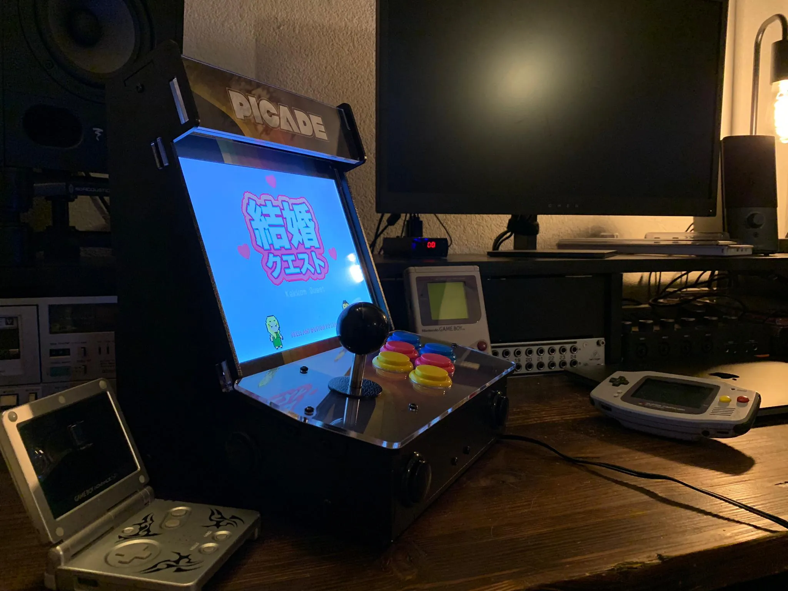
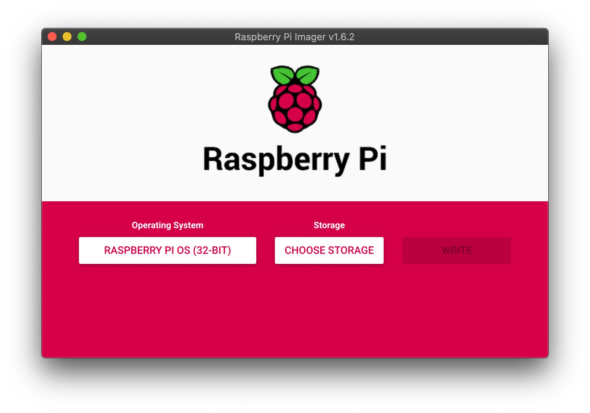

# Run Unity game on Raspberry Pi 4 with Picade arcade machine

A friend approached me to help him install a game he implemented with [Unity](https://unity.com/) on his Raspberry Pi 4B (4GB) bundled with a Picade retro arcade machine. Here are the steps we followed to install it.



<!-- truncate -->

The main issue was that the Raspberry board is powered by an ARM CPU which is not compatible with the x86_64 builds that Unity could do. We have tried running an Android build of the game, but it did not launch. The game itself is a retro platformer with limited graphical features, therefore we finally went with the WebGL approach, running the game in a browser on the Raspberry Pi.

## Prerequisites

- [Raspberry Pi 4B](https://www.raspberrypi.com/products/raspberry-pi-4-model-b/)
- [Picade](https://shop.pimoroni.com/products/picade?variant=29210087489619)
- micro SD card, at least 4 GB

## Write the OS image to the SD card

We have used [Raspberry Pi Imager](https://www.raspberrypi.com/software/) to write the recommended Raspberry Pi OS (32-bit) to the SD card.



Once the writing is done, plug the SD card into the Raspberry and boot it, filling the prompts as they come. We recommend to change the default password as otherwise an alert window will show up at boot. We changed it to a simple `raspberry2` as security is not a requirement.

## Connect to the Raspberry Pi via WiFi

As we had to copy some files on the Raspberry, it was convenient to connect to it via SSH over WiFi (my machine doesn’t have Ethernet ports).

You need to first connect the Raspberry to the WiFi. We connected a keyboard to it in order to enter the password, as well as a mouse to navigate the menus.

Once it is done, you need to activate the SSH interface:

```
Preferences Menu > Raspberry Pi Configuration > Interfaces Tab > Enable SSH > OK
```

Then from your machine you can connect to it by running:

```shell
ssh pi@raspberrypi.local
```

and entering your password (`raspberry2` for us).

## Deploy game

A WebGL build needs to be served by a web server, a browser cannot simply open the `index.html` file. We have therefore used [NGINX](https://nginx.org/en/) for this task.

1. Export a WebGL build to your machine in `${game-dir}`
2. On the Raspberry, create a directory for the game: `mkdir /home/pi/game`
3. Copy the build from your machine to the Raspberry: `scp -r ${game-dir} pi@raspberrypi.local:/home/pi/game`
4. Install NGINX on the Raspberry: `sudo apt install nginx`

## Point the default web server to the game folder

For the following, we used `vim` to edit files, which can be installed with: `sudo apt install vim`.

1. Open an editor in the default server: `sudo vim /etc/nginx/sites-enabled/default`
2. Change this line: `root /var/www/html;`
3. To: `root /home/pi/game/${game-dir};`
4. Save and close `vim`: ESC + `:wq`
5. Launch NGINX: `sudo /etc/init.d/nginx start`

NGINX will run at boot, so there is no need of additional setup.

The game should now be available when opening [http://localhost](http://localhost) in a web browser on the Raspberry. You can also open such a window from your machine through SSH using:

```shell
DISPLAY=:0 chromium-browser --start-fullscreen http://localhost
```

## Install Picade driver

Run:

```shell
curl -sS https://get.pimoroni.com/picadehat | bash
```

Then reboot the Raspberry Pi with: `sudo reboot`.

## Setup the keys mapping

You need to edit the `/boot/config.txt` file to set key mappings for the Picade Arcade. We display our example hereafter, but you can find all [key codes in their definition file](https://github.com/torvalds/linux/blob/master/include/uapi/linux/input-event-codes.h).

Open the config file: `vim /boot/config.txt` and add the following under `[all]`:

```
[all]
dtoverlay=picade # should already be present
dtparam=escape=114 # volume down
dtparam=enter=115 # volume up
dtparam=start=25 # p
dtparam=coin=113 # mute
dtparam=button1=24 # o
dtparam=button4=37 # k
dtparam=up=17 
dtparam=down=31
dtparam=left=30
dtparam=right=32
dtparam=button2=23 # i
dtparam=button3=22 # u
dtparam=button5=36 # j
dtparam=button6=35 # h
```

## Start fullscreen browser with game on boot

We have used **autostart** to run the browser at boot since it is a GUI application.

1. Open a new file with: `vim /etc/xdg/autostart/game-browser.desktop` (the `.desktop` extension is important!)
2. Write the following inside:

```
[Desktop Entry]
Name=Chrome
Exec=chromium-browser --noerrors --disable-session-crashed-bubble --disable-infobars --kiosk http://localhost --incognito
```

We need the `--noerrors --disable-session-crashed-bubble --disable-infobars --incognito` options to avoid the “restore pages” pop-up after reboot. The `--kiosk` option prevents displaying the “Press F11 to exit fullscreen” message at boot.

[The default `index.html`](https://gist.github.com/kebetsi/f251cbf6dac7a4a6dcf74a0e9e177665) file provided in Unity’s WebGL build does not display the game in fullscreen. We had to change the `body` in the `/home/pi/game/${game-directory}/index.html` file to this:

```html
<body>
 <div class=”webgl-content”>
   <div id=”unityContainer” style=”width: 1152px; height: 864px”>
   </div>
 </div>
</body>
```

The values for `width` and `length` have been set according to the Picade screen. We have also removed the footer with the Unity logo.

You can find the full example: [here](https://gist.github.com/kebetsi/ba6c60c653257e04cbb866080ed96e02).

## Fix sound

Booting chromium in kiosk mode has muted the sound on the Raspberry. This required the player to unmute the game to activate the sound after each boot. We have done the following to ensure it is on:

1. Unmute the game manually with the mouse
2. Save the setting by running: `sudo alsactl store`

We still require to press any button from the start screen to activate sound, which seems to be the case because we’re out of focus from the chromium window, but we deemed it sufficient.

## Cleanup background to display on load

When the Raspberry Pi will boot, we do not wish to display the default Raspberry Pi OS desktop, but a custom image.

Setup the wallpaper you wish by going:

```
Preferences Menu > Raspberry Pi Configuration > Desktop Tab > Picture
```

Hide the trash icon by unchecking `Wastebasket` in the same menu.

Finally we have hidden the taskbar by right-clicking on it, then on `Panel Settings`, then going to the `Advanced` tab and checking `Minimize panel when not in use`. We have also set its default size to a minimum by setting its `width` to `0%` and `height` to the minimum `16 pixels`. It slightly appears on the top left corner, but it was sufficient for our use case.

## Hide mouse tracker

1. Open the GUI config file: `vim /etc/lightdm/lightdm.conf`
2. under `[Seat:*]`, add the following line: `xserver-command=X -nocursor`

This makes the mouse tracker invisible, but you are still be able to use it if needed.

## The result

[Booting the Raspberry Pi directly into the game](https://www.youtube.com/watch?v=ZARZHkZeiZA)

## Try the game

We have published the game online, [you can try it here](https://astro.toys/Kekkon-Quest/).

## Sources

- Raspberry Pi imager: https://www.raspberrypi.org/software/
- Connect to Raspberry via WiFi: https://medium.com/@nikosmouroutis/how-to-setup-your-raspberry-pi-and-connect-to-it-through-ssh-and-your-local-wifi-ac53d3839be9
- Install NGINX on Raspberry Pi: https://www.raspberrypi.org/documentation/remote-access/web-server/nginx.md
- Install Picade driver: https://learn.pimoroni.com/tutorial/sandyj/getting-started-with-picade-hat
- Setup Picade keys mapping: https://github.com/pimoroni/picade-hat
- Stop “restore pages” pop-up: https://www.raspberrypi.org/forums/viewtopic.php?t=212015
- Unmute sound: https://www.raspberrypi.org/forums/viewtopic.php?t=169216
- Hide Mouse: https://www.raspberrypi.org/forums/viewtopic.php?t=234879

