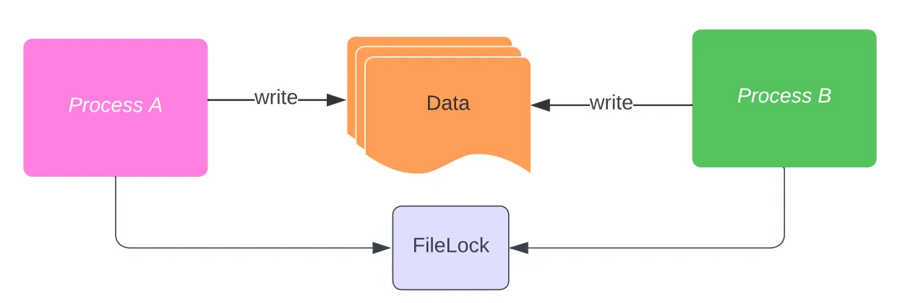

# Inter-process synchronization in Java using FileLock

On a work project, we needed to fix a concurrency issue where multiple processes would write at the same time in the same file, which led to file corruption.



To fix this issue, we have opted to use the Java [FileLock](https://docs.oracle.com/javase/8/docs/api/java/nio/channels/FileLock.html) that has been available since Java 1.4.

This allows for multiple processes, not threads, to synchronize by writing the lock into a file. If, like in my use case, you want to synchronize file writing, you should use a dedicated/separate file for locking. Using the file you intend to read or execute for locking will lead to it being corrupted, as the FileLock will modify it.

Obtaining a FileLock requires creating a [FileOutputStream](https://docs.oracle.com/javase/8/docs/api/java/io/FileOutputStream.html), obtaining a [FileChannel](https://docs.oracle.com/javase/8/docs/api/index.html?java/nio/channels/FileChannel.html) on it, and calling `FileChannnel.lock()` or `FileChannel.tryLock()`:

```java
try (
  FileOutputStream fos = new FileOutputStream("lockFile");
  FileChannel channel = fos.getChannel()
  ) {
  FileLock lock = channel.tryLock();
  if (lock != null) {
    // do stuff while you have an exclusive lock
    lock.release();
  } else {
    // do something else or wait since another process has acquired the lock
  }
}
```

If you are using `FileChannel.lock()`, upon failure to obtain it, the function will raise an exception, so you will need to handle that case in the catch block and not the `lock != null` else clause:

```java
try (
  FileOutputStream fos = new FileOutputStream("lockFile");
  FileChannel channel = fos.getChannel()
  ) {
  FileLock lock = channel.lock();
  // do stuff while you have an exclusive lock
  lock.release();
} catch (OverlappingFileLockException e) {
  // do something else or wait since another process has acquired the lock
}
```