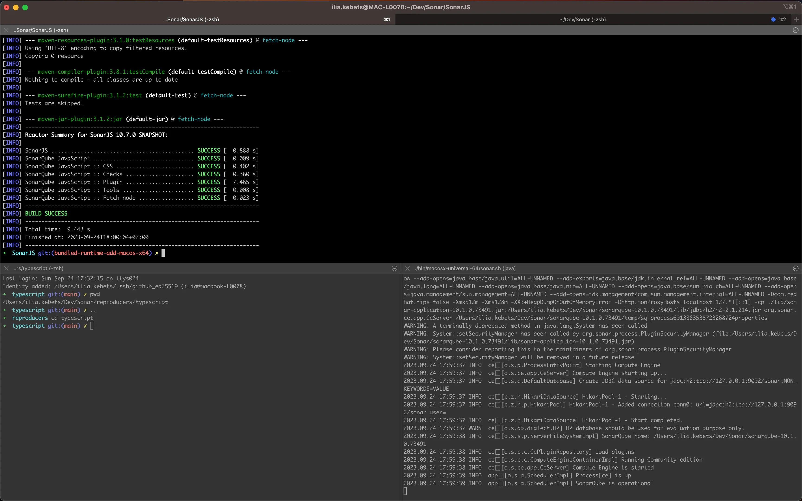
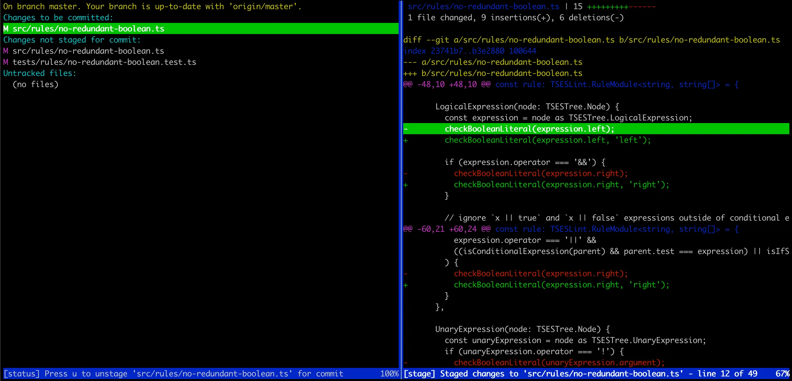
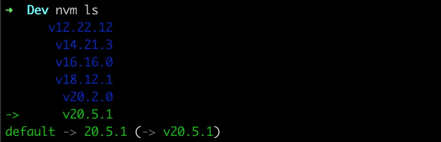
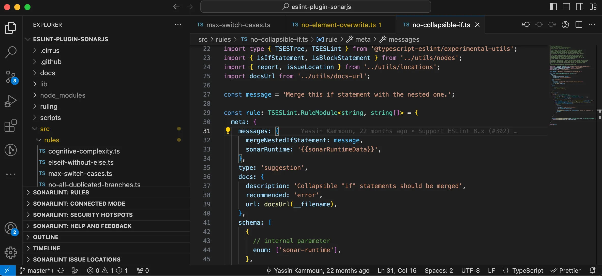
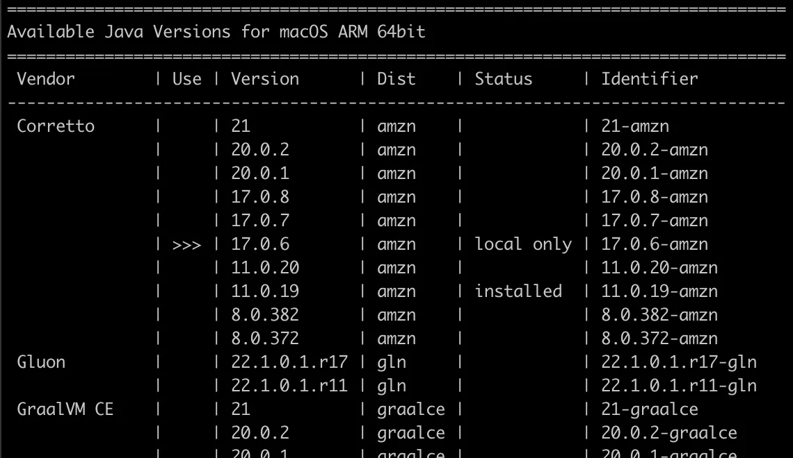
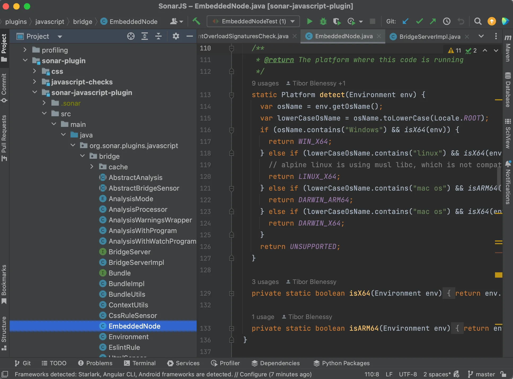
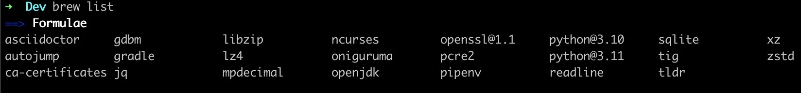

# MacOS software development tools

I cover the different tools I use on MacOS to facilitate and speed up my work as a software developer.

<!-- truncate -->

## Terminal

I use [iTerm2](https://iterm2.com/) as my terminal. It allows me to split my screen into multiple parts when I need to monitor multiple processes on a single screen. `CMD+D` and `CMD+Shift+D` for horizontal and vertical split respectively. One setting I always tweak is the [line buffer size](https://stackoverflow.com/questions/12459755/zsh-iterm2-increase-number-of-lines-history/28608448#28608448).

As a shell, I use [Oh My Zsh](https://ohmyz.sh/#install) for its out-of-the-box [plugins](https://github.com/ohmyzsh/ohmyzsh/wiki/Plugins) offering shortcuts and because it displays my current branch in git repositories. My main shortcuts are for git and folder navigation:

- `gco`: git checkout
- `gm`: git merge
- `gl`: git pull
- `gp`: git push
- `ll`: ls -l
- `..` and `...`, etc: `cd ..`, `cd ../..`, etc

For folder navigation, I also use [autojump](https://github.com/wting/autojump) which allows me to jump quickly between folders I visited like `j my-repo`. It matches the target folder by name and number of visits.

I don’t like the wall of text that `man` pages usually output, so I use [tldr pages](https://tldr.sh/).

## Git client

I use [tig](https://jonas.github.io/tig/) as a CLI git client, it’s a fast tool that allows me to stage files, cherry-picking blocks of codes or lines if needed. Navigating through the log is very convenient as it supports the same search keys as `less`. Here is a [great article](https://www.atlassian.com/blog/git/git-tig) about it.

You can open the log view with `tig`, but I recommend setting up this alias to open **tig** in Status view directly: `alias s="tig status"`. If you use “Oh My Zsh”, you should append this in `~/.zshrc`.

I configure `git` to track remote branches automatically: `git config --global --add --bool push.autoSetupRemote true`.

Also, I prefer that `git branch` (or `gb`) doesn’t pipe its output in less with `git config --global pager.branch false`.

## Node.js

I use [nvm](https://github.com/nvm-sh/nvm) to work with multiple versions of Node.js. You can install a new version like 20 with your global dependencies using: `nvm install 20 --reinstall-from=current`.

Switch between versions easily with `nvm use 18` and update your default with `nvm alias default 20`.

## JavaScript/TypeScript IDE

As the majority of people, I use the [VS code](https://code.visualstudio.com/download) IDE for JS/TS.

I open it from the terminal using `code .` which you can set up [like that](https://code.visualstudio.com/docs/setup/mac#_launching-from-the-command-line).

For extensions:

- [GitLens](https://marketplace.visualstudio.com/items?itemName=eamodio.gitlens) provides blame information on lines of code, for context
- [Jest runner](https://marketplace.visualstudio.com/items?itemName=firsttris.vscode-jest-runner) easily runs single test suites from the IDE, with a debugger if needed
- [ESLint](https://marketplace.visualstudio.com/items?itemName=dbaeumer.vscode-eslint), [SonarLint](https://marketplace.visualstudio.com/items?itemName=SonarSource.sonarlint-vscode), [Shellcheck](https://marketplace.visualstudio.com/items?itemName=timonwong.shellcheck), and [Prettier](https://marketplace.visualstudio.com/items?itemName=esbenp.prettier-vscode) in the linter department

## Java

I use [sdkman](https://sdkman.io/) to install and switch between Java versions.

I use [IntelliJ](https://www.jetbrains.com/idea/) as an IDE for Java. It has a lot more built-in tools for Java development and beats VS code to it. It requires some time to learn all the shortcuts that will make you a power user but makes up for the loading time it spends indexing the projects.

## Misc

For many of the tools here, I used [homebrew](https://brew.sh/) to install them.

For app multiplexing on the desktop, I use [Moom](https://apps.apple.com/us/app/moom-classic/id419330170?mt=12) which is a paid tool. It allows me to resize apps to fit half or a quarter of a screen like on Windows.
