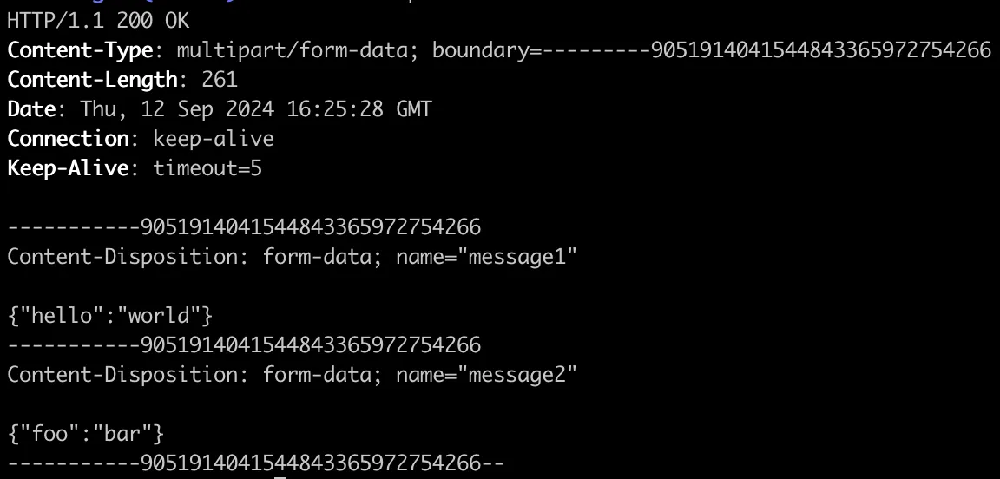
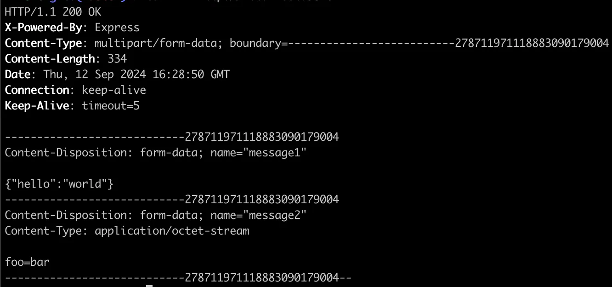

# Multipart Form-data response parsing in Java and JavaScript

In this article, I will show you how to implement an HTTP server that **replies with form-data** and how to parse it from the client. I will provide examples for the server in Node.js, using external libraries and native ones. For the client, I will show implementations in JS and Java.

All the presented code snippets can be found [here](https://github.com/kebetsi/kebetsi.github.io/tree/main/code-snippets/2024-09-16-form-data-response#code-snippets-from-multipart-form-data-post).

<!-- truncate -->

I will illustrate cases where the parts are only text and a mix of text and binary data.

[Form-data is the way browsers send the contents of the `<form>` element](https://developer.mozilla.org/en-US/docs/Learn/Forms/Sending_and_retrieving_form_data). It is also the way for the HTTP protocol to send key-value data in a POST request which supports values of different formats, such as text and binary.

## Form-data with text



### JS server — with libraries

We use the [express](https://www.npmjs.com/package/express) and [form-data](https://www.npmjs.com/package/form-data) libraries in this example for convenience.

We use JSON data for the text, but it can also be plain text. We append each part with its name, here `message1` and `message2` to the `formData` instance, set the required headers. Finally, we must pipe it into the response stream.

I had to use `127.0.0.1` instead of `localhost` for the host address on the JS server side, because the Java clients would not resolve it.

```js
const http = require('http');
const app = require('express')();
const formData = require('form-data');
const PORT = '9876';
const HOST = '127.0.0.1';

const message1 = JSON.stringify({ hello: 'world' });
const message2 = JSON.stringify({ foo: 'bar' });

const requestHandler = ((_, response) => {
  const fd = new formData();
  fd.append('message1', message1);
  fd.append('message2', message2);
  // generates the "multipart/form-data; boundary=..." header
  response.set('Content-Type', fd.getHeaders()['content-type']);
  response.set('Content-Length', fd.getLengthSync());
  fd.pipe(response);
});

app.use(requestHandler);

const server = http.createServer(app);
server.listen(PORT, HOST, err => {
  if (err) {
    return console.log('something bad happened', err);
  }
  console.log(`server is listening on ${HOST}:${PORT}`);
});
```

### JS server — without libraries

For a unit test in the Java component, I had to implement a mock server that was not using any libraries. It helped me have a better understanding of the form-data layout.

The body starts with the boundary string which is then used to split every part of the message. The boundary must have a length of up to 70 characters, and you can read more about it [here](https://www.w3.org/Protocols/rfc1341/7_2_Multipart.html).

Then, each part is organized as follows:

1. Starts with `\r\n`
2. its header, which contains the name of the part
3. 2 times `\r\n`
4. its body
5. ends with `\r\n`

We must ensure that the body length in bytes is properly computed and not forget the `Content-Type` header.

```js
const http = require('http');
const formData = require('form-data');
const PORT = '9876';
const HOST = '127.0.0.1';

const message1 = JSON.stringify({ hello: 'world' });
const message2 = JSON.stringify({ foo: 'bar' });

const requestHandler = (request, response) => {
  let data = '';
  request.on('data', chunk => (data += chunk));
  request.on('end', () => {
    // do something with the incoming data if needed
    const boundary = '---------9051914041544843365972754266';
    const contentTypeHeader = `multipart/form-data; boundary=${boundary}`;
    let body = '';
    body += `--${boundary}`;
    body += `\r\n`;
    body += `Content-Disposition: form-data; name="message1"`;
    body += `\r\n`;
    body += `\r\n`;
    body += `${message1}`;
    body += `\r\n`;
    body += `--${boundary}`;
    body += `\r\n`;
    body += `Content-Disposition: form-data; name="message2"`;
    body += `\r\n`;
    body += `\r\n`;
    body += `${message2}`;
    body += `\r\n`;
    body += `--${boundary}--`;
    body += `\r\n`;
    response.writeHead(200, {
      'Content-Type': contentTypeHeader,
      'Content-Length': Buffer.byteLength(body, 'utf-8'),
    });
    response.end(body);
  });
};

const server = http.createServer(requestHandler);

server.listen(PORT, HOST, err => {
  if (err) {
    return console.log('something bad happened', err);
  }
  console.log(`server is listening on ${HOST}:${PORT}`);
});
```

### Java client

We start by extracting the boundary string from the `Content-Type` header, which we use to split the separate parts of the body with `response.body().split(...)`. Most client libraries will generate one for you as you saw in the previous example.

Then we use the `\r\n\r\n` separator to split between each part’s header and body. As you can see in the library-less server implementation above, we must trim the `\r\n` form-data boilerplate. If we are handling JSON data, we could simplify this part using [String.trim()](https://docs.oracle.com/javase/8/docs/api/java/lang/String.html#trim--).

```java
import java.net.URI;
import java.net.URISyntaxException;
import java.net.http.HttpClient;
import java.net.http.HttpRequest;
import java.net.http.HttpResponse;
import java.net.http.HttpResponse.BodyHandlers;
import java.time.Duration;

public class MyClient {

  public record MyApiResponse(String message1, String message2) {};

  public static MyApiResponse parseFormData(String contentTypeHeader, String responseBody) {
    String boundary = "--" + contentTypeHeader.split("boundary=")[1];
    String[] parts = responseBody.split(boundary);
    String message1 = null;
    String message2 = null;
    for (String part : parts) {
      // Split the part into headers and body
      int separatorIndex = part.indexOf("\r\n\r\n");
      if (separatorIndex == -1) {
        // Skip if there's no body
        continue;
      }
      // I remove the first 2 bytes, representing "\r\n" before the headers
      String headers = part.substring(2, separatorIndex);
      // I remove the first 4 bytes and last 2.
      // They are the "\r\n\r\n" before and "\r\n" after the payload
      String partBody = part.substring(separatorIndex + 4, part.length() - 2);

      if (headers.contains("message1")) {
        message1 = partBody;
      } else if (headers.contains("message2")) {
        message2 = partBody;
      }
    }
    if (message1 == null || message2 == null) {
      throw new IllegalStateException("Data missing from response");
    }
    return new MyApiResponse(message1, message2);
  }

  public static MyApiResponse sendRequest(String host, int port) throws Exception {
    HttpRequest request =
      HttpRequest
        .newBuilder()
        .uri(url(host, port, "hello"))
        .GET()
        .build();
    HttpClient client =
      HttpClient
        .newBuilder()
        .connectTimeout(Duration.ofSeconds(30))
        .build();
    HttpResponse<String> response =
      client
        .send(request, BodyHandlers.ofString());
    String contentTypeHeader = response.headers()
      .firstValue("Content-Type")
      .orElseThrow(() -> new IllegalStateException("No Content-Type header"));
    String responseBody = response.body();
    return parseFormData(contentTypeHeader, responseBody);
  }

  private static URI url(String host, int port, String endpoint) {
    try {
      return new URI("http", null, host, port, "/" + endpoint, null, null);
    } catch (URISyntaxException e) {
      throw new IllegalStateException("Invalid URI: " + e.getMessage(), e);
    }
  }

  public static void main(String[] args) throws Exception {
    MyApiResponse response = sendRequest("localhost", 9876);
    System.out.println(response); // MyApiResponse[message1={"hello":"world"}, message2={"foo":"bar"}]
  }
}
```

### JS client

For the HTTP request, we use the [fetch API](https://developer.mozilla.org/en-US/docs/Web/API/Fetch_API) available in modern browsers and Node.js since version 18.

```js
async function request(host, port) {
  const res = await fetch(`http://${host}:${port}/hello`);
  const fd = await res.formData();
  const message1 = fd.get('message1');
  const message2 = fd.get('message2');
  return [message1, message2];
}

(async () => {
  const response = await request('localhost', 9876)
  console.log(response); // [ '{"hello":"world"}', '{"foo":"bar"}' ]
})();
```

## Form-data with binary data



We change the `message2` part to be treated as a binary, while `message1` stays the same.

### JS server — with libraries

We use a simple string for `message2`, but it accepts a Buffer object such as the bytes from a file given by the result of `fs.readFileSync()`.

```js
const http = require('http');
const app = require('express')();
const formData = require('form-data');
// const fs = require('fs');

const PORT = '9876';
const HOST = '127.0.0.1';

const message1 = JSON.stringify({ hello: 'world' });
const message2 = Buffer.from('foo=bar');
// const message2 = fs.readFileSync('path/to/my/file');

const requestHandler = ((_, response) => {
  const fd = new formData();
  fd.append('message1', message1);
  fd.append('message2', message2);
  response.set('Content-Type', fd.getHeaders()['content-type']);
  response.set('Content-Length', fd.getLengthSync());
  fd.pipe(response);
});

app.use(requestHandler);

const server = http.createServer(app);
server.listen(PORT, HOST, err => {
  if (err) {
    return console.log('something bad happened', err);
  }
  console.log(`server is listening on ${HOST}:${PORT}`);
});
```

### JS server — without libraries

When sending binary data, we need to convert the string parts and separators using [Buffer.from()](https://nodejs.org/api/buffer.html#static-method-bufferfromstring-encoding) and join them using [Buffer.concat()](https://nodejs.org/api/buffer.html#static-method-bufferconcatlist-totallength).

For the binary part, we need to add a `Content-Type` header inside the body.

```js
const http = require('http');
const formData = require('form-data');
// const fs = require('fs');

const PORT = '9876';
const HOST = '127.0.0.1';

const message1 = JSON.stringify({ hello: 'world' });
const message2 = Buffer.from('foo=bar');
// const message2 = fs.readFileSync('path/to/my/file');

const requestHandler = (request, response) => {
  let data = '';
  request.on('data', chunk => (data += chunk));
  request.on('end', () => {

    const boundary = '---------9051914041544843365972754266';
    const contentTypeHeader = `multipart/form-data; boundary=${boundary}`;
    let firstPart = '';
    firstPart += `--${boundary}`;
    firstPart += `\r\n`;
    firstPart += `Content-Disposition: form-data; name="message1"`;
    firstPart += `\r\n`;
    firstPart += `\r\n`;
    firstPart += `${message1}`;
    firstPart += `\r\n`;
    firstPart += `--${boundary}`;
    firstPart += `\r\n`;
    firstPart += `Content-Disposition: form-data; name="message2"`;
    firstPart += `\r\n`;
    firstPart += `Content-Type: application/octet-stream`;
    firstPart += `\r\n`;
    firstPart += `\r\n`;
    let lastPart = '';
    lastPart += `\r\n`;
    lastPart += `--${boundary}--`;
    lastPart += `\r\n`;
    const body = Buffer.concat([Buffer.from(firstPart), message2, Buffer.from(lastPart)]);
    const contentLength = body.length;
    response.writeHead(200, {
      'Content-Type': contentTypeHeader,
      'Content-Length': contentLength,
    });
    response.end(body);
  });
};

const server = http.createServer(requestHandler);

server.listen(PORT, HOST, err => {
  if (err) {
    return console.log('something bad happened', err);
  }
  console.log(`server is listening on ${HOST}:${PORT}`);
});
```

### Java client

Now, the change is that the HTTP response body is a byte array, so we must manipulate bytes instead of Strings in our parsing function.

First, we translate the boundary in bytes using `boundary.getBytes()`.

Then we use custom `indexOf()` and `split()` methods that operate on bytes to separate the Form-Data parts. We must also trim the headers and body of the different parts.

```java
import java.net.http.HttpClient;
import java.net.http.HttpRequest;
import java.net.http.HttpResponse;
import java.net.http.HttpResponse.BodyHandlers;
import java.net.URI;
import java.net.URISyntaxException;
import java.nio.charset.StandardCharsets;
import java.time.Duration;
import java.util.Arrays;
import java.util.LinkedList;
import java.util.List;

public class MyClientData {

  public record MyApiResponse(String message1, byte[] message2) {};

  public static MyApiResponse parseFormData(String contentTypeHeader, byte[] responseBody) {
    String boundary = "--" + contentTypeHeader.split("boundary=")[1];
    byte[] boundaryBytes = boundary.getBytes(StandardCharsets.ISO_8859_1);
    List<byte[]> parts = split(responseBody, boundaryBytes);

    String message1 = null;
    byte[] message2 = null;

    for (byte[] part : parts) {
      int separatorIndex = indexOf(part, "\r\n\r\n".getBytes(StandardCharsets.ISO_8859_1));
      if (separatorIndex == -1) {
        // Skip if there's no body
        continue;
      }

      // I remove the first 2 bytes, representing "\r\n" before the headers
      byte[] headers = Arrays.copyOfRange(part, 2, separatorIndex);
      // I remove the first 4 bytes and last 2.
      // They are the "\r\n\r\n" before and "\r\n" after the payload
      byte[] body = Arrays.copyOfRange(part, separatorIndex + 4, part.length - 2);

      String headersStr = new String(headers, StandardCharsets.UTF_8);

      if (headersStr.contains("message1")) {
        message1 = new String(body, StandardCharsets.UTF_8);
      } else if (headersStr.contains("message2")) {
        message2 = body;
      }
    }
    if (message1 == null || message2 == null) {
      throw new IllegalStateException("Data missing from response");
    }
    return new MyApiResponse(message1, message2);
  }

  private static int indexOf(byte[] array, byte[] pattern) {
    for (int i = 0; i < array.length - pattern.length + 1; i++) {
      boolean found = true;
      for (int j = 0; j < pattern.length; j++) {
        if (array[i + j] != pattern[j]) {
          found = false;
          break;
        }
      }
      if (found) return i;
    }
    return -1;
  }

  private static List<byte[]> split(byte[] array, byte[] delimiter) {
    List<byte[]> byteArrays = new LinkedList<>();
    if (delimiter.length == 0) {
      return byteArrays;
    }
    int begin = 0;

    outer:
    for (int i = 0; i < array.length - delimiter.length + 1; i++) {
      for (int j = 0; j < delimiter.length; j++) {
        if (array[i + j] != delimiter[j]) {
          continue outer;
        }
      }
      byteArrays.add(Arrays.copyOfRange(array, begin, i));
      begin = i + delimiter.length;
    }
    byteArrays.add(Arrays.copyOfRange(array, begin, array.length));
    return byteArrays;
  }

  public static MyApiResponse sendRequest(String host, int port) throws Exception {
    HttpRequest request =
      HttpRequest
        .newBuilder(url(host, port, "hello"))
        .GET()
        .build();
    HttpClient client =
      HttpClient
        .newBuilder()
        .connectTimeout(Duration.ofSeconds(30))
        .build();
    HttpResponse<byte[]> response =
      client
        .send(request, BodyHandlers.ofByteArray());
    String contentTypeHeader = response.headers()
      .firstValue("Content-Type")
      .orElseThrow(() -> new IllegalStateException("No Content-Type header"));
    byte[] responseBody = response.body();
    return parseFormData(contentTypeHeader, responseBody);
  }

  private static URI url(String host, int port, String endpoint) {
    try {
      return new URI("http", null, host, port, "/" + endpoint, null, null);
    } catch (URISyntaxException e) {
      throw new IllegalStateException("Invalid URI: " + e.getMessage(), e);
    }
  }

  public static void main(String[] args) throws Exception {
    MyApiResponse response = sendRequest("localhost", 9876);
    System.out.println(response.message1() + " " + new String(response.message2(), StandardCharsets.UTF_8)); // {"hello":"world"} foo=bar
  }
}
```

### JS client

For the JS client, we must call [Blob.arrayBuffer()](https://developer.mozilla.org/en-US/docs/Web/API/Blob/arrayBuffer) to obtain the adequate interface.

```js
async function request(host, port) {
  const res = await fetch(`http://${host}:${port}/hello`);
  const fd = await res.formData();
  const message1 = fd.get('message1');
  const message2 = fd.get('message2');
  const buffer = Buffer.from(await message2.arrayBuffer());
  return [message1, buffer];
}

(async () => {
  const response = await request('localhost', 9876)
  console.log(response[0], response[1].toString()); // {"hello":"world"} foo=bar
})();
```

## Conclusion

I wrote this article because I didn’t find much sources that explained how to parse Form-Data in an HTTP response. Most of what I found covers either the building of such a request or how to parse it on the server side.

I hope this helps other people implementing these parts, as I have strived to provide working code samples alongside my explanations.

Working on this task and writing this article has provided me a better understand of the Form-Data layout and the various HTTP library APIs around it.